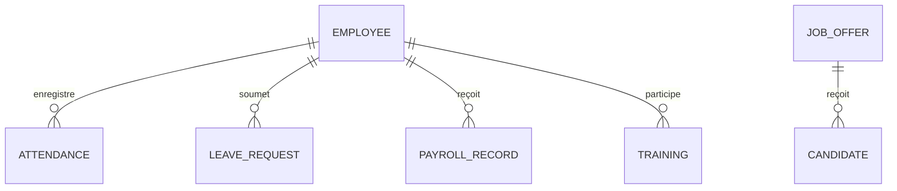

# RAPPORT DE PROJET : Système de Gestion des Ressources Humaines (GRH)

**Auteur** : [Votre Nom]
**Date** : 7 Janvier 2026
**Objet** : Documentation technique et fonctionnelle du projet GRH

---

## 1. Introduction

Dans le contexte actuel de transformation numérique, la gestion efficace du capital humain est devenue un pilier stratégique pour toute organisation. Ce projet consiste en la conception et la réalisation d'une application web moderne dédiée à la Gestion des Ressources Humaines (GRH). L'objectif est de centraliser les processus administratifs, d'automatiser le suivi opérationnel et d'offrir une interface intuitive pour le pilotage des effectifs.

## 2. Analyse Fonctionnelle (Cahier des Charges)

L'application est structurée autour de plusieurs modules clés répondant aux besoins critiques d'un service RH :

### A. Gestion du Personnel (Employees)
- Centralisation des fiches employés (coordonnées, poste, département).
- Suivi du cycle de vie des collaborateurs.

### B. Recrutement
- Création et publication d'offres d'emploi.
- Gestion des candidatures et suivi des étapes de sélection (Job Offers & Candidates).

### C. Gestion du Temps et des Absences
- **Attendance** : Pointage et suivi de la présence quotidienne.
- **Leaves** : Gestion des demandes de congés et workflow de validation.

### D. Gestion de la Paie (Payroll)
- Calcul automatique des salaires.
- Historique des paiements et génération des fiches de paie.

### E. Développement des Compétences (Training)
- Catalogue de formations disponibles.
- Suivi de la montée en compétences des salariés.

## 3. Architecture Technique

Le choix de la stack technologique a été dicté par des impératifs de performance, de maintenabilité et de sécurité.

### A. Stack Technologique
- **Frontend** : React 19 avec Next.js 15+ (App Router).
- **Styling** : Tailwind CSS pour un design "Utility-First" et responsive.
- **Composants** : Radix UI pour l'accessibilité.
- **Backend** : Next.js Server Actions pour la logique métier sécurisée.
- **Base de Données** : MySQL avec le driver `mysql2` et gestion de pool de connexions.
- **Validation** : Zod pour le schéma de données et TypeScript pour le typage statique.

### B. Modèle de Données (Aperçu)

## 4. Implémentation

L'implémentation suit les meilleures pratiques du développement web moderne :
- **Modularité** : Chaque fonctionnalité est isolée dans un dossier spécifique sous le répertoire `app/`.
- **Réutilisation** : Des composants UI atomiques (boutons, inputs, dialogues) sont centralisés dans `components/ui/`.
- **Sécurité** : Utilisation de Server Actions pour éviter l'exposition des API sensibles et Bcrypt pour la protection des données.

## 5. Conclusion et Perspectives

Le système GRH développé offre une base solide pour la gestion quotidienne d'une entreprise. Les perspectives d'évolution incluent :
- L'intégration d'un module d'évaluation de la performance (KPIs avancés).
- La mise en œuvre d'un système de notification en temps réel.
- L'ajout d'une application mobile pour les employés (Self-service).

---
*Fin du rapport.*
